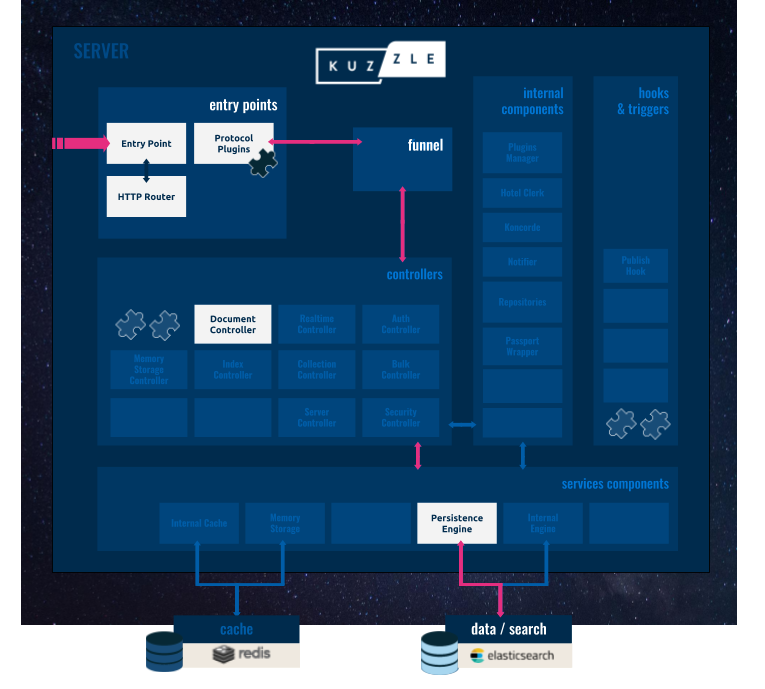
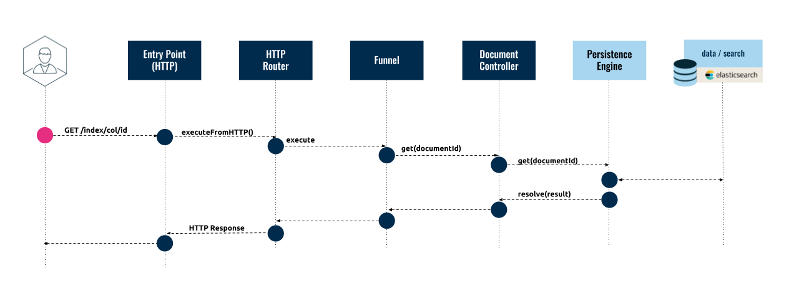
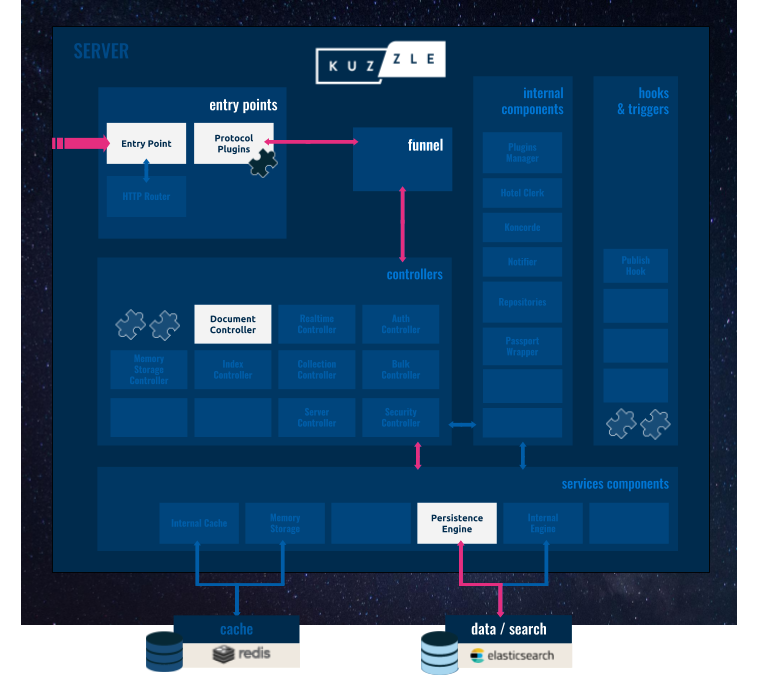
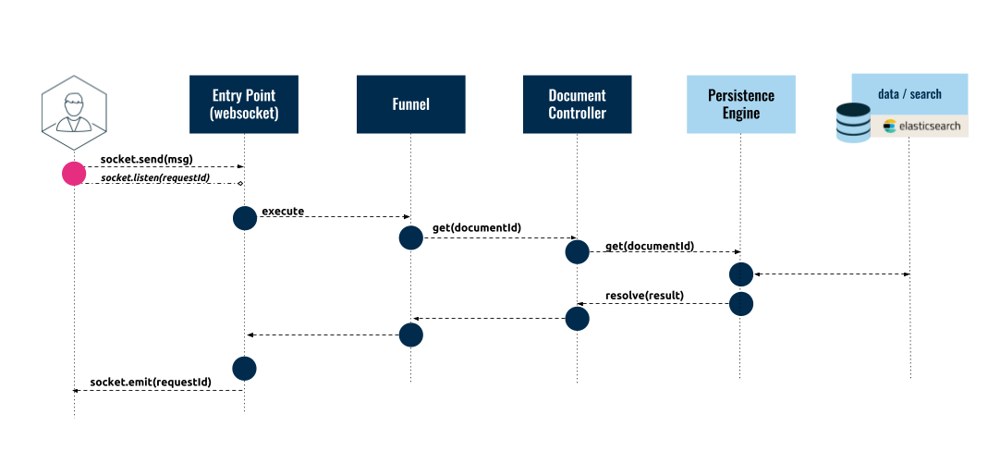
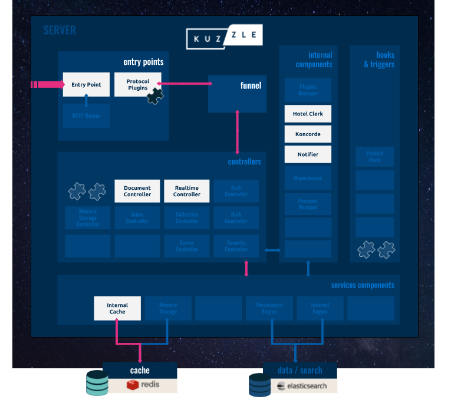
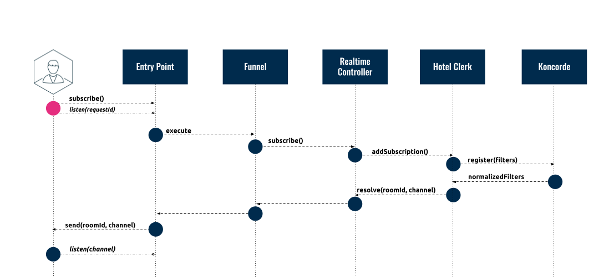
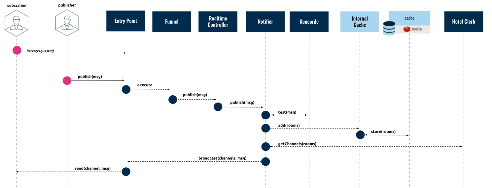

# Request Life-Cycle

In this section we are going to focus on how requests are processed by Kuzzle. We are going to analyze the life-cycle of a request in order to review Kuzzle server's internal architecture.

Kuzzle has two main modes of communication:

- **Synchronous**: Clients send requests to the Kuzzle server, which processes the data using the [Document Controller](/api/1/controller-document) and then sends a response back to the client.

- **Asynchronous**: Clients subscribe to the Kuzzle server via the [Real-time/Subscribe](/api/1/controller-realtime/publish) API action and receive data asynchronously as a result of a [Real-time/Publish](/api/1/controller-realtime/publish) API action or a [Document Controller](/api/1/controller-document) event.

These modes of communication are generally independant from the transport protocol. For example, a synchronous request can be made via HTTP or Websockets.

---

## Synchronous Communication

In a synchronous request, the Kuzzle server will receive a request, process it, and return the result in a response over the same channel. All this is done sequentially.

Currently all forms of synchronous communication pass through the Document Controller and involve some operation on persistent data: a synchronous request will generally be used to read, create, update, or delete a document.

Depending on the transport protocol used to communicate with the Kuzzle server, different components of the architecture will be used; however, in all cases the data will flow through the Document Controller to and from the storage layer. To demonstrate, we will describe how a "read" request is performed, using two different protocols: HTTP and Websocket. The process is similar for a synchronous update or write.

### Synchronous Request using HTTP Protocol

In the diagram below, we highlighted the components of Kuzzle's server [architecture](/core/1/guide/kuzzle-depth) that are used in a read request using HTTP:



The following diagram shows how a request flows between the client application, the different Kuzzle server components, and the external services:



- The HTTP client will request a document by making an HTTP GET request. For instance, to retrieve a document with `_id` equal to `739c26bc-7a09-469a-803d-623c4045b0cb` in the `users` collection, the client will perform the following request: `GET http://kuzzlebackend:7512/myindex/users/739c26bc-7a09-469a-803d-623c4045b0cb`.

- The _Entry Point_ receives the message and passes it on to the _HTTP Router_.

- The _HTTP Router_ creates a [Request Input](https://github.com/kuzzleio/kuzzle-common-objects/blob/master/README.md#modelsrequestinput) object and sends it to the _Funnel_. The `Request Input` will look like this:

```javascript
{
  "controller": "document",
  "action": "get",
  "resource": {
    "index": "myindex",
    "collection": "users",
    "_id": "739c26bc-7a09-469a-803d-623c4045b0cb"
  }
}
```

- The _Funnel_ then validates the formatted data and sends it to the _Document Controller_.

- The _Document Controller_ then requests the document from the _Persistence Engine_.

- The _Persistence Engine_ retrieves the data from the document store (Elasticsearch) and returns a document to the _Document Controller_ which looks like this:

```javascript
{
  "_index": "myindex",
  "_type": "users",
  "_id": "739c26bc-7a09-469a-803d-623c4045b0cb",
  "_version": 1,
  "found": true,
  "_source": {
      "firstName": "Grace",
      "lastName": "Hopper",
      "age": 85,
      "location": {
          "lat": 32.692742,
          "lon": -97.114127
      },
      "city": "NYC",
      "hobby": "computer"
  }
}
```

 <br/>
* The document will make its way through the chain of components until it is received by the client application.

### Synchronous Request using Websocket Protocol

In the diagram below, we highlighted the components of Kuzzle's server [architecture](/core/1/guide/kuzzle-depth) that are used in a read request using Websockets:



The following diagram shows how a request flows between the client application, the different Kuzzle server components, and the external services:



- The client application opens a websocket connection to Kuzzle server and sends a request message. For example, to retrieve a document with `_id` equal to `739c26bc-7a09-469a-803d-623c4045b0cb` in the `users` collection, the client application will send the following message:

```javascript
{
  "requestId": "ed4faaff-253a-464f-a6b3-387af9d8483d",
  "index": "myindex",
  "controller": "document",
  "action": "get",
  "collection": "users",
  "_id": "739c26bc-7a09-469a-803d-623c4045b0cb"
}
```

 <br/>
* The client application then listens to the `< requestId >` event on the socket. For example:

```javascript
this.socket.once('ed4faaff-253a-464f-a6b3-387af9d8483d', function(response) {
  callback(response);
});
```

 <br/>
* The *Entry Point* receives the message and creates a [Request Input](https://github.com/kuzzleio/kuzzle-common-objects/blob/master/README.md#modelsrequestinput) object which it passes to the *Funnel*. The `Request Input` looks like this:

```javascript
{
  "controller": "read",
  "action": "get",
  "resource": {
    "index": "myindex",
    "collection": "users",
    "_id": "739c26bc-7a09-469a-803d-623c4045b0cb"
  }
}
```

- The _Funnel_ then validates the formatted data and sends it to the _Document Controller_.

- The _Document Controller_ then requests the document from the _Persistence Engine_.

- The _Persistence Engine_ retrieves the data from the document store (Elasticsearch) and returns a document to the _Document Controller_ which looks like this:

```javascript
{
  "_index": "myindex",
  "_type": "users",
  "_id": "739c26bc-7a09-469a-803d-623c4045b0cb",
  "_version": 1,
  "found": true,
  "_source": {
      "firstName": "Grace",
      "lastName": "Hopper",
      "age": 85,
      "location": {
          "lat": 32.692742,
          "lon": -97.114127
      },
      "city": "NYC",
      "hobby": "computer"
  }
}
```

- The document will make its way back through the chain of components back to the _Entry Point_.

- The _Entry Point_ emits the `< requestId >` response and the client application receives it.

---

## Asynchronous Communication

In an asynchronous request, Kuzzle server will receive a request over one channel, process it, and trigger a response over another channel. In order to receive the response, the Client application must subscribe to the channel. Because two separate channels are used, the request and response do not need to be made by the same client nor do they need to be made sequentially.

This form of communication is generally referred to as publish/subscribe, because on the one side a client is **subscribing** to a channel and on the other side a client is **publishing** to a channel.

This subsection describes the life-cycle of real-time notifications which implement the [Publish/Subscribe](https://en.wikipedia.org/wiki/Publish%E2%80%93subscribe_pattern) pattern. In the diagram below, we highlighted the components of Kuzzle's server [architecture](/core/1/guide/kuzzle-depth) that are used in this pattern:


#### Subscribing to a Channel

The following diagram shows how a client can subscribe to a channel.



- The client application opens a socket (or MQ) connection, sends a subscription request (see the [API Documentation](/api/1/controller-realtime/subscribe)), and then listens for the `< requestId >` event on the socket. The subscription request is a message that contains a filter description that defines which events should trigger a response. For instance, the following filter will trigger a response anytime content is posted to the `users` collection that contains the field `hobby` with value `computer` (see the [Koncorde Reference](/koncorde/1/) for more details):

```javascript
{
  "controller": "realtime",
  "action": "subscribe",
  "index": "myindex",
  "collection": "users",
  "body": {
    "equals": {
      "hobby": "computer"
    }
  },
  "state": "all"
}
```

 <br/>
* The Kuzzle server receives the message and the *Entry Point* creates a [Request Input](https://github.com/kuzzleio/kuzzle-common-objects/blob/master/README.md#modelsrequestinput) object with the following format:

```javascript
{
  "controller": "realtime",
  "action": "subscribe",
  "resource": {
    "index": "myindex",
    "collection": "users"
  },
  "body": {
    "equals": {
      "hobby": "computer"
    }
  },
  "state": "all"
}
```

 <br/>
* The  *Entry Point* passes the `Request Input` to the *Funnel*.

- The _Funnel_ validates the request and forwards it to the _Realtime Controller_.

- The _Realtime Controller_ registers the subscription with the _Hotel Clerk_, an internal component that acts as a lookup table of subscribers.

- The _Hotel Clerk_ calls _Koncorde_ to normalize the filters and register the subscription (see [Koncorde](https://github.com/kuzzleio/koncorde) for more details). It then sends a response which includes the `channel` ID back to the _Entry Point_.

- The _Entry Point_ then returns a response to the client, which includes a `< requestId >` and the `channel` ID, and looks like this:

```javascript
{
  "requestId": "ed4faaff-253a-464f-a6b3-387af9d8483d",
  "status": 200,
  "error": null,
  "controller": "realtime",
  "action": "subscribe",
  "index": "myindex",
  "collection": "users",
  "result": {
    "roomId": "78c5b0ba-fead-4535-945c-8d64a7927459",
    "channel": "c5cd8bdc-06a4-4d6e-bae3-61f1a8ac2982"
  }
}
```

 <br/>

- The client can now subscribe to the `channel` and listen to events in order to be notified any time a message is processed that matches the subscription filters.

#### Publishing to a Channel Directly

The following diagram shows how the Kuzzle server triggers a response as a result of a publish request made using the [Real-time/Publish](/api/1/controller-realtime/publish) action.



- The _Realtime Controller_ receives the **publish** request from a client and sends it to the _Notifier_ component.
- The _Notifier_ calls _Koncorde_ to check if the content matches any filters.
- The _Notifier_ uses the _Internal Cache_ to store the mappings into cache.
- The _Notifier_ calls the _Hotel Clerk_ to get the channels related to the filters.
- The _Notifier_ broadcasts the message for each channel that is linked to the filter.
- Finally, the _Entry Point_ emits the message to the clients that are **subscribed** to it.

#### Publishing to a Channel Indirectly

The following diagram shows how Kuzzle uses the Document Controller to trigger a notification as a result of a change in persistent data.


- A client makes a synchronous **create** request, which goes through the Kuzzle server components to the _Document Controller_.
- The _Document Controller_ sends the data to the _Persistence Engine_.
- Once the document is stored, the _Document Controller_ calls the _Notifier_ component.
- The _Notifier_ then calls the _Internal Cache_ to check if the content matches any filters.
- The _Notifier_ calls the _Hotel Clerk_ to get the channels related to the filters.
- The _Notifier_ asks the _Entry Point_ to broadcast the notification to all clients that are **subscribed** to the channels.
